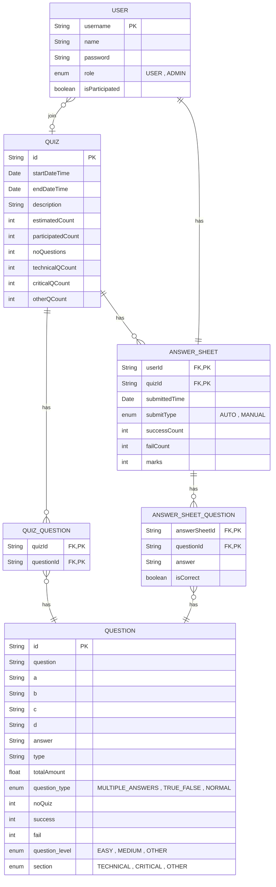

```mermaid

erDiagram
    USER {
        String username PK
        String name
        String password
        enum role "USER , ADMIN"
        boolean isParticipated

    }

    QUIZ {
        String id PK
        Date startDateTime
        Date endDateTime
        String description
        int estimatedCount
        int participatedCount
        int noQuestions
        int technicalQCount
        int criticalQCount
        int otherQCount

    }

    QUIZ_QUESTION {
        String quizId FK , PK
        String questionId FK , PK
        
    }

    QUESTION {
        String id PK
        String question
        String a
        String b
        String c
        String d
        String answer
        String type
        float totalAmount
        enum question_type "MULTIPLE_ANSWERS , TRUE_FALSE , NORMAL"
        int noQuiz
        int success
        int fail
        enum question_level "EASY , MEDIUM , OTHER"
        enum section "TECHNICAL , CRITICAL , OTHER"

    }

    ANSWER_SHEET {
        String userId FK , PK
        String quizId FK , PK
        Date submittedTime
        enum submitType "AUTO , MANUAL"
        int successCount
        int failCount
        int marks

    }

    ANSWER_SHEET_QUESTION {
        String answerSheetId FK , PK
        String questionId FK , PK
        String answer
        boolean isCorrect

    }

    
USER }o--o| QUIZ : join
QUIZ ||--o{ QUIZ_QUESTION : has
QUIZ_QUESTION }o--|| QUESTION : has
QUIZ ||--o{ ANSWER_SHEET : has
ANSWER_SHEET ||--|| USER : has
ANSWER_SHEET ||--o{ ANSWER_SHEET_QUESTION : has
ANSWER_SHEET_QUESTION }o--|| QUESTION : has
    

```
