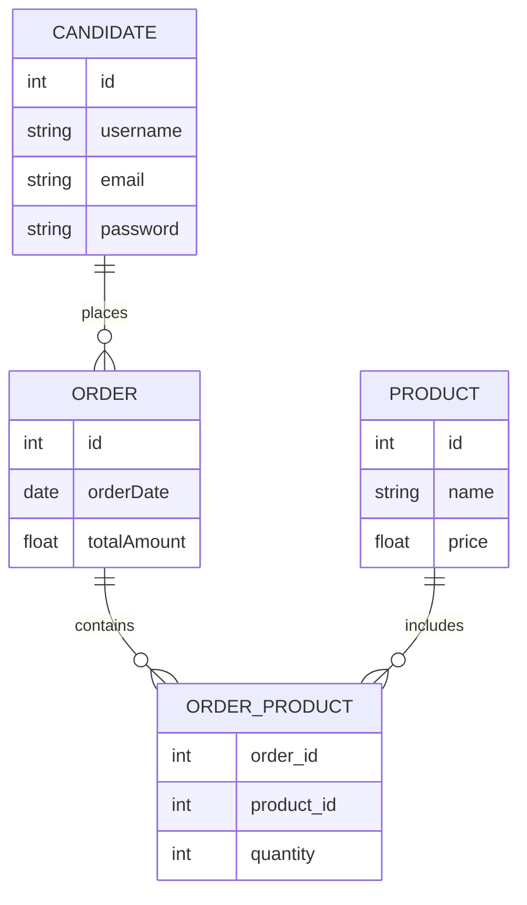

```mermaid
erDiagram
    CANDIDATE {
        int id
        string username
        string email
        string password
    }

    ORDER {
        int id
        date orderDate
        float totalAmount
    }

    PRODUCT {
        int id
        string name
        float price
    }

    ORDER_PRODUCT {
        int order_id
        int product_id
        int quantity
    }

    CANDIDATE ||--o{ ORDER : places
    ORDER ||--o{ ORDER_PRODUCT : contains
    PRODUCT ||--o{ ORDER_PRODUCT : includes

```
