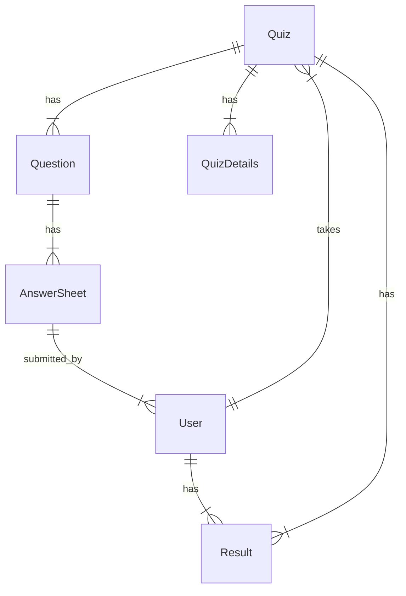
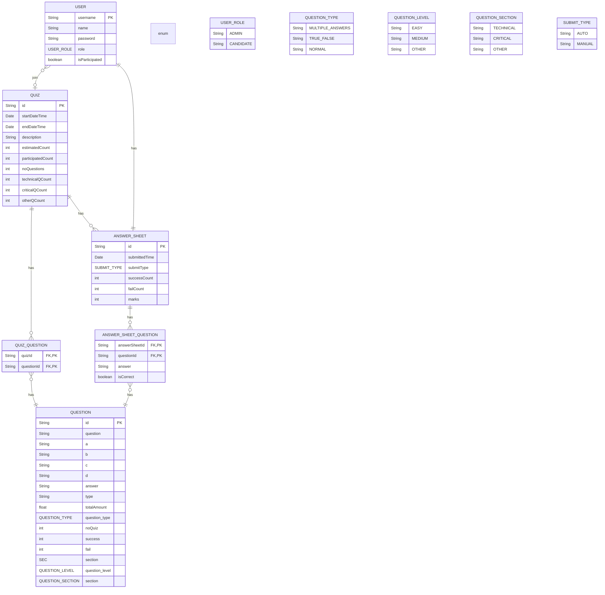

```mermaid
    erDiagram
    Quiz ||--|{ Question : has
    Quiz ||--|{ QuizDetails : has
    User ||--|{ Quiz : takes
    User ||--|{ Result : has
    Question ||--|{ AnswerSheet : has
    Quiz ||--|{ Result : has
    AnswerSheet ||--|{ User : submitted_by    

```

```mermaid

erDiagram
    USER {
        String username PK
        String name
        String password
        USER_ROLE role
        boolean isParticipated

    }

    QUIZ {
        String id PK
        Date startDateTime
        Date endDateTime
        String description
        int estimatedCount
        int participatedCount
        int noQuestions
        int technicalQCount
        int criticalQCount
        int otherQCount

    }

    QUIZ_QUESTION {
        String quizId FK , PK
        String questionId FK , PK
        
    }

    QUESTION {
        String id PK
        String question
        String a
        String b
        String c
        String d
        String answer
        String type
        float totalAmount
        QUESTION_TYPE question_type
        int noQuiz
        int success
        int fail
        SEC section
        QUESTION_LEVEL question_level
        QUESTION_SECTION section

    }

    ANSWER_SHEET {
        String id PK
        Date submittedTime
        SUBMIT_TYPE submitType
        int successCount
        int failCount
        int marks

    }

    ANSWER_SHEET_QUESTION {
        String answerSheetId FK , PK
        String questionId FK , PK
        String answer
        boolean isCorrect

    }

    enum USER_ROLE {
        String ADMIN
        String CANDIDATE

    }

    enum QUESTION_TYPE {
        String MULTIPLE_ANSWERS
        String TRUE_FALSE
        String NORMAL

    }
    
    enum QUESTION_LEVEL {
        String EASY
        String MEDIUM
        String OTHER

    }
    
    enum QUESTION_SECTION {
        String TECHNICAL
        String CRITICAL
        String OTHER

    }


    enum SUBMIT_TYPE {
        String AUTO
        String MANUAL

    }


USER }o--o| QUIZ : join
QUIZ ||--o{ QUIZ_QUESTION : has
QUIZ_QUESTION }o--|| QUESTION : has
QUIZ ||--o{ ANSWER_SHEET : has
ANSWER_SHEET ||--|| USER : has
ANSWER_SHEET ||--o{ ANSWER_SHEET_QUESTION : has
ANSWER_SHEET_QUESTION }o--|| QUESTION : has
    

```

